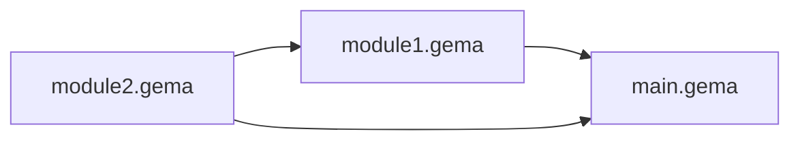

# Modules

The examples use these module files:

**File: adding.gema**

```gema
ONE_NUM = 1;
ONE_STR = "1";

func add_1(x: Num) {
  x + ONE_NUM
}

func add_1(x: Str) {
  x + ONE_STR
}

trait ToNum {
  toNum: Func[Self: Num]
}

func [T: ToNum] add_n(x: T, n: Num) {
  toNum(x) + n
}
```

## Importing all symbols from a module

```gema
use "adding.gema"

# Any top-level exported symbol from `adding.gema` is now available:
(add_1(1), add_1("hello"), ONE_NUM, ONE_STR)
```

This would be compiled to something like:

```js
const result = (() => {
  const $mod_0 = (() => {
    // <compiled contents of the adding.gema module>
    return {
      ONE_NUM,
      ONE_STR,
      add_1$0,
      add_1$1,
      add_n,
    };
  })();

  const { ONE_NUM, ONE_STR, add_1$0, add_1$1, add_n } = $mod_0;

  return [add_1$0(1), add_1$1("hello"), ONE_NUM, ONE_STR];
})();
```

Note that module names are always prefixed by `$mod` in the compiled JS.

Note that trait, struct, and enum definitions don't show up in the compiled JS, since those are figments of the Gema type system.

## Importing selected symbols from a module

```gema
use (ONE_NUM, add_1[Num]) from "adding.gema"

# Any imported symbol is legal to use; any other symbol cannot be used.
(ONE_NUM, add_1(1))
```

This would compile the same as the previous example, except the `use` statement would transpile to just

```
const { ONE_NUM, add_1$0 } = $mod_0;
```

instead of extracting _all_ the exported symbols.

### Note on importing functions

There is a distinction in Gema between anonymous and non-anonymous functions:

```gema
# An anonymous function definition, saved to a variable f
f = \x: Num -> x + 1;

# A non-anonymous function definition with name g
func g(x: Num) { x + 1 }
```

It is legal to override non-anonymous functions with a different type signature.
When importing a non-anonymous function from another module, you must specify the type signature
for the arguments of that function. For example, to import the two functions in the example above,
we would write `use (f, g[Num]) from <module name>`.

Importing a non-anonymous function works as if you had defined that function with the given type signature
in the scope where you imported it. This means you can further override it, and call it without explicitly
annotating its type signature (the type signature is inferred based on the arguments provided).

## Transitive dependencies

When we have transitive dependencies, we need to figure out the topological order of the dependencies and write
the module definitions in an order that ensures that dependencies are declared before they are imported.

Example:

**File: main.gema**

```gema
use (foo[Num]) from "module1.gema"
use (bar[Num]) from "module2.gema"

foo(1) + bar(1)
```

**File: module1.gema**

```gema
use (bar[Num]) from "module2.gema"

func foo(x: Num) {
  bar(x) + x
}
```

**File: module2.gema**

```gema
func bar(x: Num) {
  x + 1
}
```

The dependency graph looks like this:



So we in the compiled JS, we need to define `module2` first, then `module1`, then `main`:

```js
const result = (() => {
  const $mod_0 = (() => {
    function bar$0(x) {
      return x + 1;
    }

    return { bar$0 };
  })();

  const $mod_1 = (() => {
    const { bar$0 } = $mod_0;

    function foo$0(x) {
      bar$0(x) + x;
    }

    return { foo$0 };
  })();

  const { foo$0 } = $mod_1;
  const { bar$0 } = $mod_0;

  return foo$0(1) + bar$0(1);
})();
```

It is a compile-time error if the dependency graph has a cycle.

## Re-declaring and overloading imported symbols

It is not legal to declare a variable with the same name in the same scope where it was imported, in the same way that it is not legal to declare a variable with the same name in the same scope where a variable with the same name was already defined. Just like with variable definitions, it _is_ legal to shadow a variable in an inner scope.

```gema
use (x) from "module.gema"

x = 3;  # Compile-time error! Cannot re-declare x in the same scope

{
  x = 3;  # This is ok
}
```

It is not legal to re-declare a function with the same name and argument type signature in a scope as a pre-existing definition. The same rule applies to functions imported from other modules. It _is_ legal to overload imported functions with a different argument type signature.

```gema
use (foo[Num]) from "module.gema"

func foo(x: Num) { x }  # Compile-time error! Cannot define another foo[Num] in the same scope!

func foo(x: Int) { x }  # This is ok

{
  func foo(x: Num) { x }  # This is also okay -- we are shadowing in an inner scope
}
```

The numbering associated with function overloads might not match between modules:

**File: module.gema**

```gema
func foo(x: Str) { x + "!" }
func foo(x: Num) { x + 1 }
```

**File: main.gema**

```gema
use (foo[Num]) from "module.gema"

foo(1)
```

This would compile to something like

```js
const result = (() => {
  const $mod_0 = (() => {
    function foo$0(x) {
      return x + "!";
    }
    function foo$1(x) {
      return x + 1;
    }
    return { foo$0, foo$1 };
  })();

  const { foo$1: foo$0 } = $mod_0;

  return foo$0(1);
})();
```

The imported `foo` in `main.gema` is the first `foo` that appears in that module, so it gets the name `foo$0` -- even though it was the second `foo` defined in `module.gema`.
